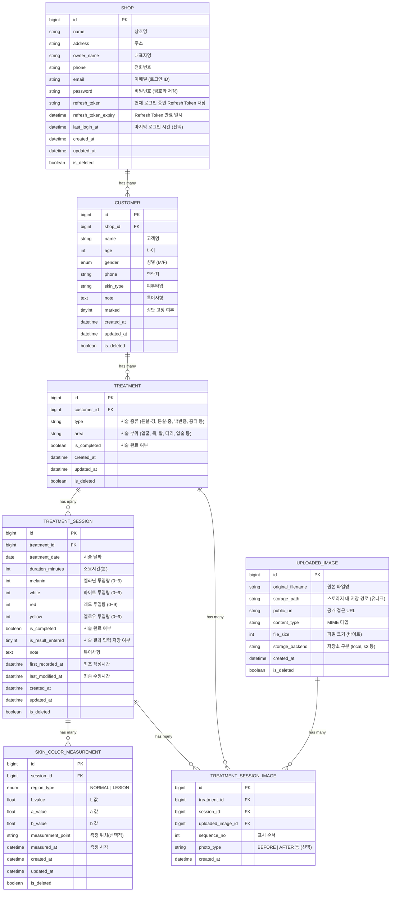

# TheArete Skin care application

## 🚀 빠른 시작 (Docker Compose)

### 1. 서비스 시작

```bash
# backend 디렉토리로 이동
cd backend

# Docker Compose로 모든 서비스 시작 (PostgreSQL + Backend)
docker compose up -d

# 또는 Makefile 사용
make docker-up
```

### 2. 서비스 상태 확인

```bash
# 실행 중인 컨테이너 확인
docker compose ps

# 로그 확인
docker compose logs -f backend

# 또는 Makefile 사용
make docker-logs
```

### 3. 데이터베이스 마이그레이션

```bash
# backend 컨테이너에서 마이그레이션 실행
docker compose exec backend alembic upgrade head

```

### 4. 서비스 중지

```bash
# 모든 서비스 중지
docker compose down

# 또는 Makefile 사용
make docker-down

# 볼륨까지 삭제하려면
docker compose down -v
```

## 📚 API 문서 접속

애플리케이션이 실행되면 다음 URL에서 API 문서를 확인할 수 있습니다:

- **Swagger UI**: http://localhost:8000/docs
- **ReDoc**: http://localhost:8000/redoc
- **OpenAPI JSON**: http://localhost:8000/openapi.json
- **Health Check**: http://localhost:8000/v1/health

## 🗄️ 데이터베이스 접속

### PostgreSQL 접속 정보

- **호스트**: localhost
- **포트**: 5432
- **데이터베이스**: mobile_backend
- **사용자**: postgres
- **비밀번호**: password

### DB Shell 접속

```bash
# Docker Compose를 통한 접속
docker compose exec postgres psql -U postgres -d mobile_backend

# 또는 Makefile 사용
make db-shell
```

## 🔧 유용한 명령어

```bash
# Backend 재빌드
docker compose build backend

# Backend만 재시작
docker compose restart backend

# 특정 서비스 로그만 확인
docker compose logs -f postgres
docker compose logs -f backend
```

## 🤖 MCP (Model Context Protocol) 설정

Cursor IDE에서 Figma 디자인을 Flutter 코드로 변환하고, 다양한 도구와 연동하기 위한 MCP 서버를 설정할 수 있습니다.

**주요 기능**:

- 🎨 **Talk to Figma MCP**: Figma 디자인을 Flutter 위젯 코드로 자동 변환, 텍스트 일괄 교체, 컴포넌트 오버라이드 전파 등
- 🔍 **GitHub MCP**: 코드 검색 및 이슈 관리
- 📁 **File System MCP**: 프로젝트 파일 탐색
- 🔎 **Brave Search MCP**: 웹 검색을 통한 최신 정보 조회
- 🗄️ **PostgreSQL/SQLite MCP**: 데이터베이스 쿼리 및 관리

**빠른 시작**:

```bash
# 1. Bun 설치 (Talk to Figma MCP 필수)
curl -fsSL https://bun.sh/install | bash

# 2. WebSocket 서버 시작 (별도 터미널)
bunx cursor-talk-to-figma-mcp@latest socket

# 3. Figma에서 플러그인 설치 및 연결
# 4. Cursor 재시작
```

**상세 설정 방법**: [MCP_SETUP.md](MCP_SETUP.md) 참고

## 📖 상세 문서

- Backend: [backend/README.md](backend/README.md)
- Flutter: [flutter/project_convention.md](flutter/project_convention.md)
- MCP 설정: [MCP_SETUP.md](MCP_SETUP.md)


